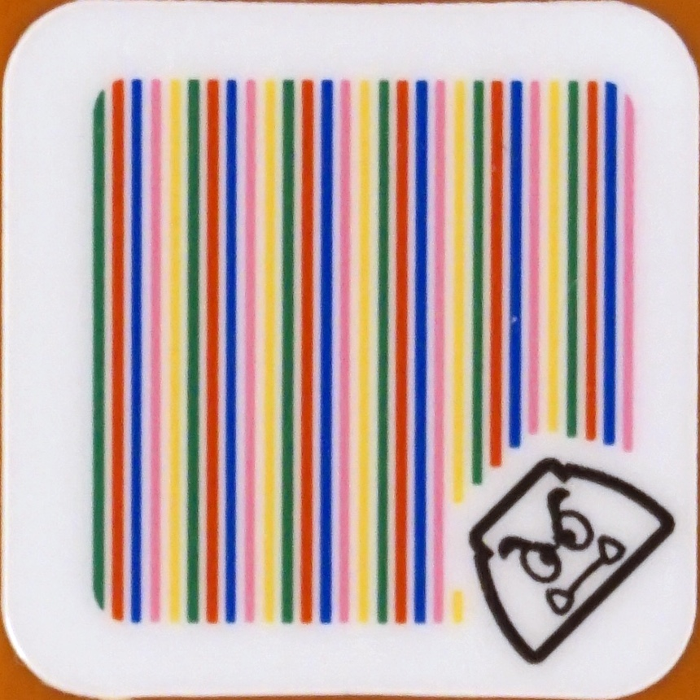
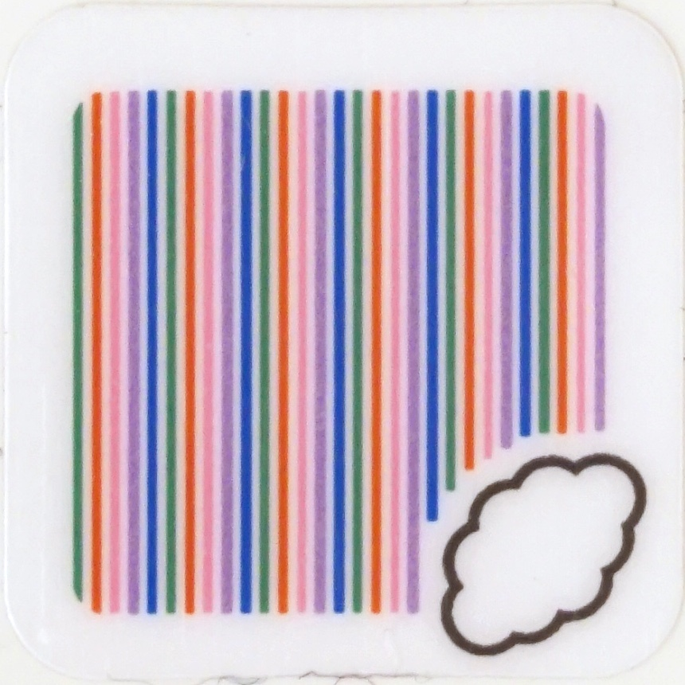
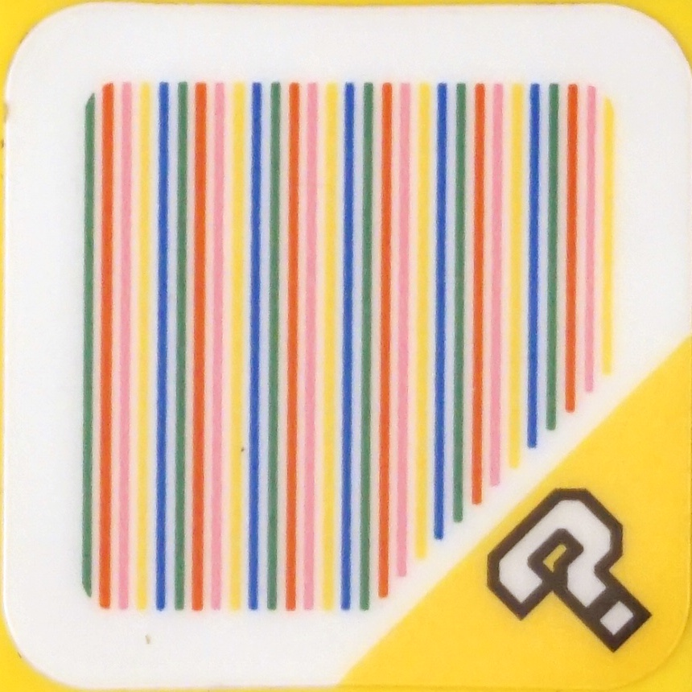
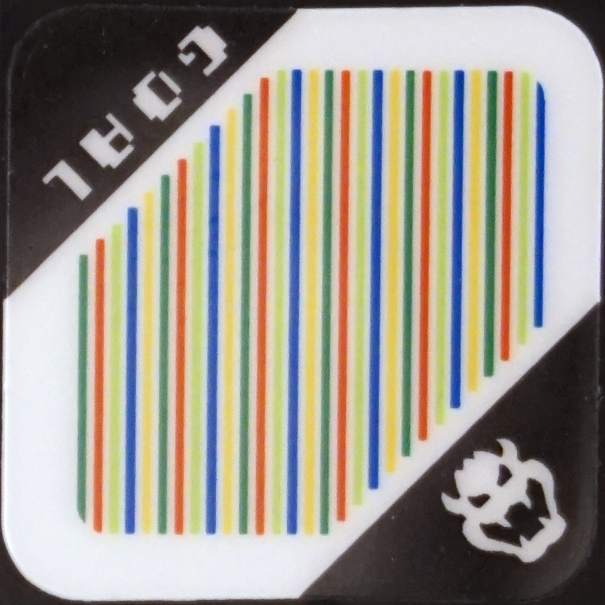
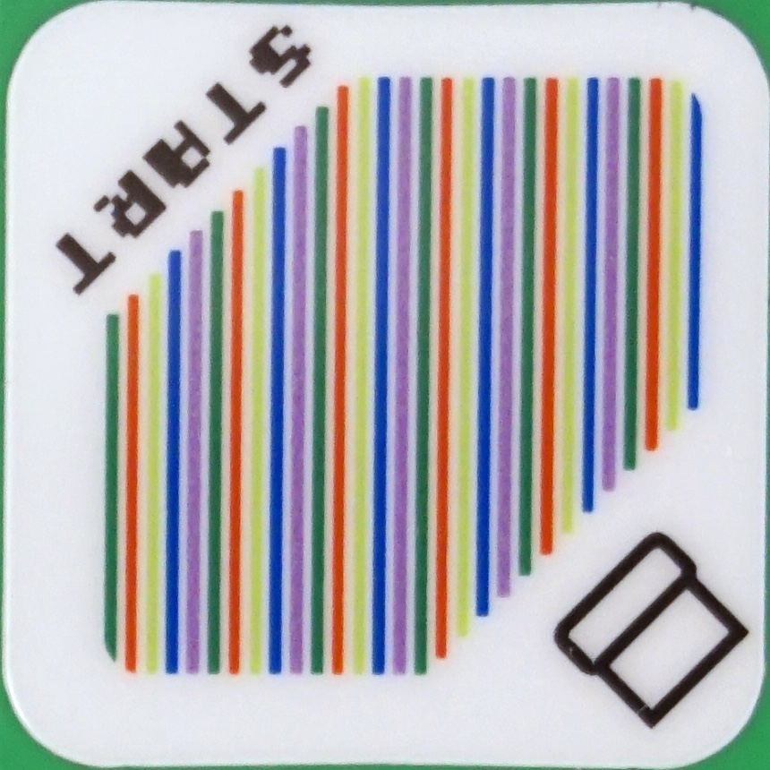
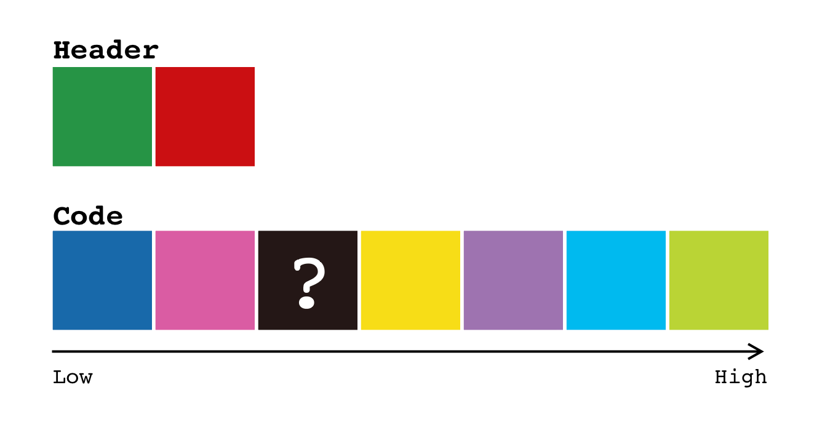
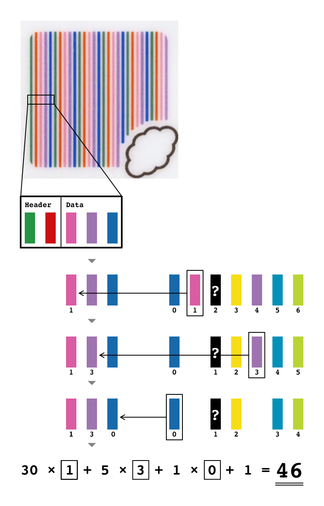

# IO Type 0x49: Color Barcode Sensor

## Port Information [0x43]

| Port ID | IO Type | Capabilities | Input Modes | Output Modes | Possible Mode Combination |
| --- | --- | --- | --- | --- | --- |
| 1 | 0x49 | Logical Combinable, Input | 0, 1 | - | [0, 1] |

## Port Mode Information [0x44]

| Port ID | Mode | Name | RAW Range | PCT Range | SI Range | Symbol | Mapping | Value Format |
| --- | --- | --- | --- | --- | --- | --- | --- | --- |
| 1 | 0 | TAG | 0 - 10 | 0 - 100 | 0 - 10 | idx | Supports NULL, Discrete | 2 * 16 bit |
|  | 1 | RGB | 0 - 10 | 0 - 100 | 0 - 10 | raw | Supports NULL, Discrete | 3 * 8 bit |

## Mode 0: Color Barcode and Color Index

| Port Value Sample | Meaning |
| --- | --- |
| `ff ff ff ff` | Not detect barcode or color |
| `02 00 ff ff` |  |
| `14 00 ff ff` |  |
| `2e 00 ff ff` |  |
| `29 00 ff ff` |  |
| `79 00 ff ff` | Bat |
| `7b 00 ff ff` | Star |
| `88 00 ff ff` | King Boo |
| `99 00 ff ff` |  |
| `b7 00 ff ff` |  |
| `b8 00 ff ff` |  |
| `ff ff 13 00` | White |
| `ff ff 15 00` | Red |
| `ff ff 17 00` | Blue |
| `ff ff 18 00` | Yellow |
| `ff ff 1a 00` | Black |
| `ff ff 25 00` | Green |
| `ff ff 6a 00` | Brown |
| `ff ff 0c 01` | ?? |
| `ff ff 38 01` | ?? |
| `ff ff 42 01` | Cyan |

## Barcode Colors

## How to Decode Color Barcode

## Mode 1: RGB Color

| Port Value Sample | Meaning |
| --- | --- |
| `04 05 05` | Black |
| `ca cd ca` | White |
| `64 11 09` | Red |
| `10 4b 2d` | Green |
| `16 42 b3` | Blue |
