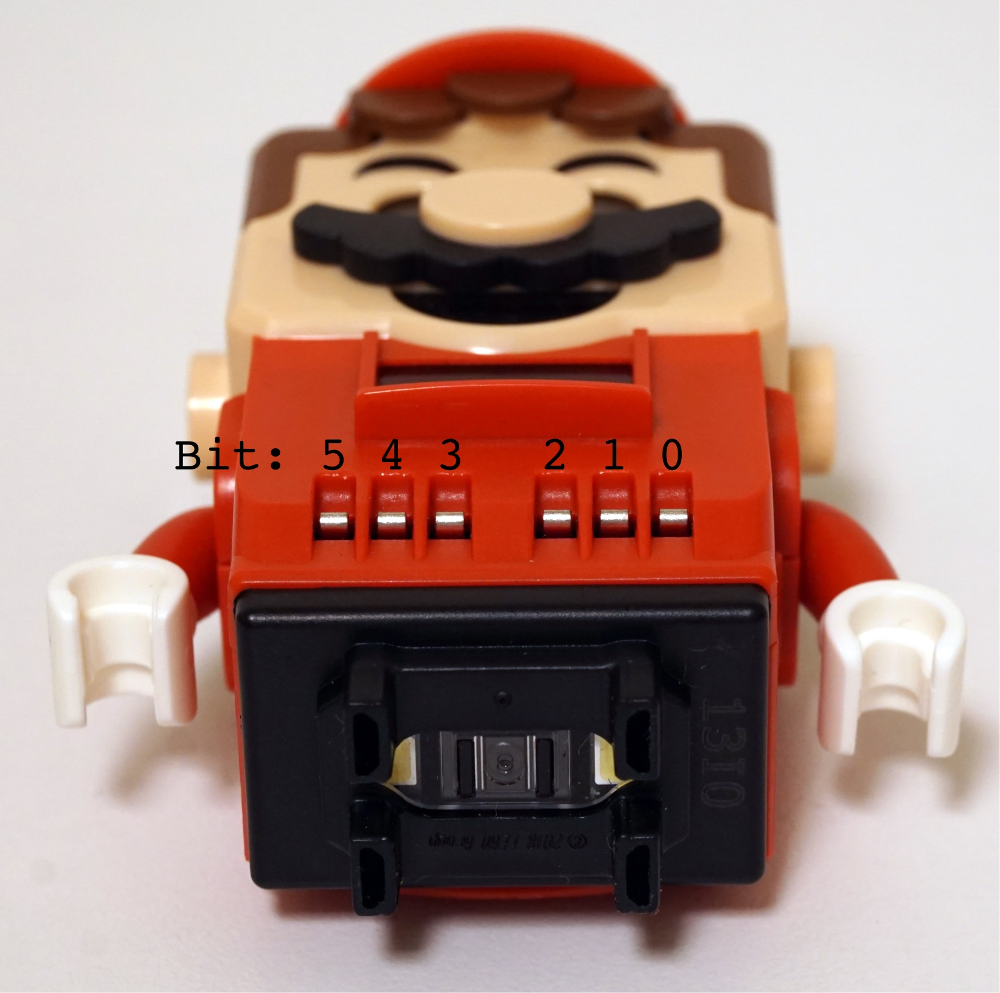

# IO Type 0x4a: Pants Sensor

## Port Information [0x43]

| Port ID | IO Type | Capabilities | Input Modes | Output Modes | Possible Mode Combination |
| --- | --- | --- | --- | --- | --- |
| 2 | 0x4a | Input | 0 | - | - |

## Port Mode Information [0x44]

| Port ID | Mode | Name | RAW Range | PCT Range | SI Range | Symbol | Mapping | Value Format |
| --- | --- | --- | --- | --- | --- | --- | --- | --- |
| 2 | 0 | PANT | 0 - 63 | 0 - 100 | 0 - 63 | idx | Supports NULL, Discrete | 1 * 8 bit |

## Mode 0: Pants

| Port Value Sample | Meaning |
| --- | --- |
| `00` | `000000` None |
| `0a` | `001010` [Tanooki](https://www.lego.com/en-us/product/tanooki-mario-power-up-pack-71385) |
| `0c` | `001100` [Propeller](https://www.lego.com/en-us/product/propeller-mario-power-up-pack-71371) |
| `11` | `010001` [Cat](https://www.lego.com/en-us/product/cat-mario-power-up-pack-71372) |
| `12` | `010010` [Fire](https://www.lego.com/en-us/product/fire-mario-power-up-pack-71370) |
| `14` | `010100` [Penguin](https://www.lego.com/en-us/product/penguin-mario-power-up-pack-71384) |
| `21` | `100001` [Normal](https://www.lego.com/en-us/product/adventures-with-mario-starter-course-71360) |
| `22` | `100010` [Builder](https://www.lego.com/en-us/product/builder-mario-power-up-pack-71373) |

## 6 bit Order

